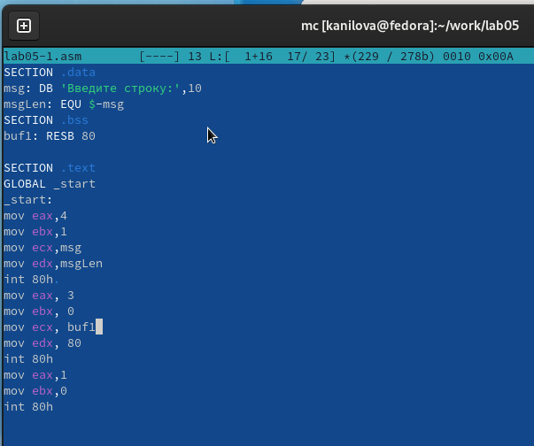

---
## Front matter
title: "Отчёт по лабораторной работе 5"
subtitle: "Архитектура компьютера"
author: "Нилова Кристина Артуровна"

## Generic otions
lang: ru-RU
toc-title: "Содержание"

## Bibliography
bibliography: bib/cite.bib
csl: pandoc/csl/gost-r-7-0-5-2008-numeric.csl

## Pdf output format
toc: true # Table of contents
toc-depth: 2
lof: true # List of figures
lot: true # List of tables
fontsize: 12pt
linestretch: 1.5
papersize: a4
documentclass: scrreprt
## I18n polyglossia
polyglossia-lang:
  name: russian
  options:
	- spelling=modern
	- babelshorthands=true
polyglossia-otherlangs:
  name: english
## I18n babel
babel-lang: russian
babel-otherlangs: english
## Fonts
mainfont: PT Serif
romanfont: PT Serif
sansfont: PT Sans
monofont: PT Mono
mainfontoptions: Ligatures=TeX
romanfontoptions: Ligatures=TeX
sansfontoptions: Ligatures=TeX,Scale=MatchLowercase
monofontoptions: Scale=MatchLowercase,Scale=0.9
## Biblatex
biblatex: true
biblio-style: "gost-numeric"
biblatexoptions:
  - parentracker=true
  - backend=biber
  - hyperref=auto
  - language=auto
  - autolang=other*
  - citestyle=gost-numeric
## Pandoc-crossref LaTeX customization
figureTitle: "Рис."
tableTitle: "Таблица"
listingTitle: "Листинг"
lofTitle: "Список иллюстраций"
lotTitle: "Список таблиц"
lolTitle: "Листинги"
## Misc options
indent: true
header-includes:
  - \usepackage{indentfirst}
  - \usepackage{float} # keep figures where there are in the text
  - \floatplacement{figure}{H} # keep figures where there are in the text
---

# Цель работы

Целью работы является приобретение практических навыков работы в Midnight Commander. 
Освоение инструкций языка ассемблера mov и int.

# Задания

1. Изучение Midnight Commander

2. Примеры программ с использованием внешнего файла in_out.asm

3. Выполнение заданий для самостоятельной работы.

# Теоретическое введение

Midnight Commander (или просто mc) — это программа, которая позволяет просматривать
структуру каталогов и выполнять основные операции по управлению файловой системой,
т.е. mc является файловым менеджером. Midnight Commander позволяет сделать работу с
файлами более удобной и наглядной.

Программа на языке ассемблера NASM, как правило, состоит из трёх секций: секция кода
программы (SECTION .text), секция инициированных (известных во время компиляции)
данных (SECTION .data) и секция неинициализированных данных (тех, под которые во
время компиляции только отводится память, а значение присваивается в ходе выполнения
программы) (SECTION .bss).

Инструкция языка ассемблера mov предназначена для дублирования данных источника в
приёмнике. В общем виде эта инструкция записывается в виде mov dst,src
Здесь операнд dst — приёмник, а src — источник

Инструкция языка ассемблера int предназначена для вызова прерывания с указанным
номером. В общем виде она записывается в виде int n
Здесь n — номер прерывания, принадлежащий диапазону 0–255

# Выполнение лабораторной работы

## Основы работы в Midnight Commander

Я открыла Midnight Commander и перешла в каталог ~/work/arch-pc. Затем я создала новый каталог под названием lab05. рис. [-@fig:001]

{ #fig:001 width=70%, height=70% }

Внутри каталога lab05 я создала файл с именем lab05-1.asm. рис. [-@fig:002]

{ #fig:002 width=70%, height=70% }

Я открыла файл lab05-1.asm для редактирования и написала в нем код программы. рис. [-@fig:003]

{ #fig:003 width=70%, height=70% }

После этого я открыла файл для просмотра и убедилась, что он содержит написанный мной код. рис. [-@fig:004]

{ #fig:004 width=70%, height=70% }

Затем я скомпилировала программу и проверила ее работу, получив исполняемый файл. рис. [-@fig:005]

{ #fig:005 width=70%, height=70% }

## Подключение внешнего файла in_out.asm

Далее, я скачала файл с именем in_out.asm и добавила его в рабочий каталог. Затем я скопировала файл lab05-1.asm и создала копию с именем lab05-2.asm. рис. [-@fig:006]

{ #fig:006 width=70%, height=70% }

Я написала код программы в файле lab05-2.asm. рис. [-@fig:007] 

{ #fig:007 width=70%, height=70% }

После этого я скомпилировала программу и проверила ее запуск. рис. [-@fig:008]

{ #fig:008 width=70%, height=70% }

В файле lab05-2.asm я внесла изменения, заменив подпрограмму sprintLF на sprint. Это позволило строке вывода не завершаться символом перехода на новую строку. рис. [-@fig:009].

{ #fig:009 width=70%, height=70% }

Затем я снова собрала исполняемый файл. Теперь после вывода строки она не будет завершаться символом перехода на новую строку. рис. [-@fig:010].

{ #fig:010 width=70%, height=70% }

##  Задание для самостоятельной работы

Я решила скопировать программу lab05-1.asm и внести изменения в код, чтобы программа выводила приглашение вроде "Введите строку:", затем считывала строку с клавиатуры и выводила ее на экран. рис. [-@fig:011][-@fig:012]

{ #fig:011 width=70%, height=70% }

{ #fig:012 width=70%, height=70% }

Также я скопировала программу lab05-2.asm и внесла соответствующие изменения в код, чтобы программа тоже выводила приглашение вроде "Введите строку:", считывала строку с клавиатуры и выводила ее на экран. рис. [-@fig:013][-@fig:014]

{ #fig:013 width=70%, height=70% }

{ #fig:014 width=70%, height=70% }

Отличие между этими двумя реализациями заключается в том, что файл in_out.asm уже содержит готовые подпрограммы для обеспечения ввода/вывода. Таким образом, нам остается только разместить данные в нужных регистрах и вызвать нужную подпрограмму с помощью инструкции call. Это упрощает кодирование и обеспечивает более гибкую работу с вводом и выводом данных.

# Выводы

Научились писать базовые ассемблерные программы. Освоили ассемблерные инструкции mov и int.