---
## Front matter
title: "Отчёт по лабораторной работе 6"
subtitle: "Архитектура компьютера"
author: "Нилова Кристина Артуровна"

## Generic otions
lang: ru-RU
toc-title: "Содержание"

## Bibliography
bibliography: bib/cite.bib
csl: pandoc/csl/gost-r-7-0-5-2008-numeric.csl

## Pdf output format
toc: true # Table of contents
toc-depth: 2
lof: true # List of figures
lot: true # List of tables
fontsize: 12pt
linestretch: 1.5
papersize: a4
documentclass: scrreprt
## I18n polyglossia
polyglossia-lang:
  name: russian
  options:
	- spelling=modern
	- babelshorthands=true
polyglossia-otherlangs:
  name: english
## I18n babel
babel-lang: russian
babel-otherlangs: english
## Fonts
mainfont: PT Serif
romanfont: PT Serif
sansfont: PT Sans
monofont: PT Mono
mainfontoptions: Ligatures=TeX
romanfontoptions: Ligatures=TeX
sansfontoptions: Ligatures=TeX,Scale=MatchLowercase
monofontoptions: Scale=MatchLowercase,Scale=0.9
## Biblatex
biblatex: true
biblio-style: "gost-numeric"
biblatexoptions:
  - parentracker=true
  - backend=biber
  - hyperref=auto
  - language=auto
  - autolang=other*
  - citestyle=gost-numeric
## Pandoc-crossref LaTeX customization
figureTitle: "Рис."
tableTitle: "Таблица"
listingTitle: "Листинг"
lofTitle: "Список иллюстраций"
lotTitle: "Список таблиц"
lolTitle: "Листинги"
## Misc options
indent: true
header-includes:
  - \usepackage{indentfirst}
  - \usepackage{float} # keep figures where there are in the text
  - \floatplacement{figure}{H} # keep figures where there are in the text
---

# Цель работы

Целью работы является освоение арифметических инструкций языка ассемблера NASM.

# Задания

1. Изучение арифметических действий

2. Примеры программ с вычислниями

3. Выполнение заданий для самостоятельной работы.

# Теоретическое введение

Схема команды целочисленного сложения add (от англ. addition - добавление) выполняет
сложение двух операндов и записывает результат по адресу первого операнда.

Команда целочисленного вычитания sub (от англ. subtraction – вычитание) работает аналогично команде add.

Существуют специальные команды: inc (от англ. increment) и dec (от англ. decrement), которые увеличивают и уменьшают на 1 свой операнд.

Умножение и деление, в отличии от сложения и вычитания, для знаковых и беззнаковых
чисел производиться по-разному, поэтому существуют различные команды.
Для беззнакового умножения используется команда mul (от англ. multiply – умножение),
для знакового умножения используется команда imul.

Для деления, как и для умножения, существует 2 команды div (от англ. divide - деление) и idiv

# Выполнение лабораторной работы

## Символьные и численные данные в NASM

Я создала каталог для хранения программ к лабораторной работе номер шесть, 
после чего перешла в этот каталог и создала файл с исходным кодом программы под названием 
lab6-1.asm, как показано на рисунке [-@fig:001].

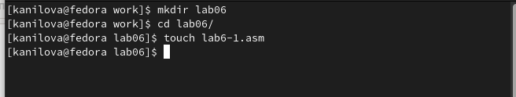{ #fig:001 width=70%, height=70% }

Теперь давайте взглянем на примеры программ, которые отображают символы и числовые 
значения на экран. Эти программы будут использовать регистр eax для вывода значений.

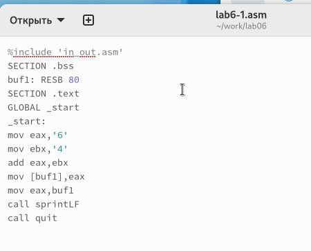{ #fig:002 width=70%, height=70% }

В одном из примеров, который вы можете увидеть на рисунке [-@fig:002], программа 
записывает символ '6' в регистр eax с помощью инструкции mov eax, '6', а символ '4' 
помещается в регистр ebx с помощью инструкции mov ebx, '4'. 
Затем я выполняю сложение значений, находящихся в регистрах ebx и eax, и результат 
записывается обратно в eax с помощью инструкции add eax, ebx. 
После этого нужно вывести результат на экран.

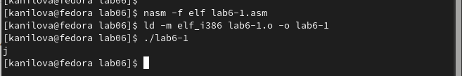{ #fig:003 width=70%, height=70% }

Однако, чтобы функция sprintLF работала правильно, необходимо передать в eax адрес данных. 
Поэтому я использую вспомогательную переменную buf1. 
Сначала я перемещаю значение из eax в buf1 с помощью инструкции mov [buf1], eax, 
а потом загружаю адрес переменной buf1 обратно в регистр eax (mov eax, buf1), 
прежде чем вызвать sprintLF.

В итоге, вместо того чтобы увидеть на экране число 10, мы видим символ 'j'. 
Это происходит из-за особенностей кодировки символов: символ '6' имеет двоичный код 
00110110 (или 54 в десятичном виде), а '4' — 00110100 (или 52 в десятичном виде). 
Сложив эти значения, мы получаем двоичный код 01101010, что в десятичной системе 
равно 106, и это соответствует символу 'j', как показано на рисунке [-@fig:003].

Теперь я внесу изменения в исходный код программы, чтобы в регистрах хранились числовые 
значения, а не символы, как это показано на иллюстрации [-@fig:004].

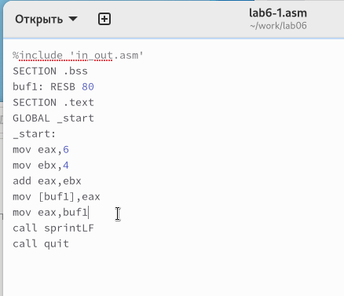{ #fig:004 width=70%, height=70% }

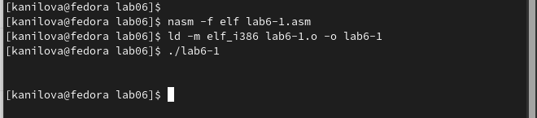{ #fig:005 width=70%, height=70% }

Когда я запускаю программу, она не выдаёт число 10. 
На экран выводится символ с ASCII-кодом 10, который означает новую строку, 
как видно на рисунке [-@fig:005]. 
Этот символ невидим в терминале, но он создаёт пустую строку в моём выводе.

Я помню, что ранее в файле in_out.asm были созданы специальные функции, 
чтобы преобразовывать символы ASCII в числа и обратно. Используя эти функции, 
я изменила код программы, что можно увидеть на иллюстрации [-@fig:006].

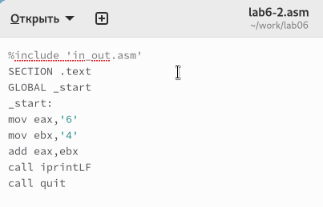{ #fig:006 width=70%, height=70% }

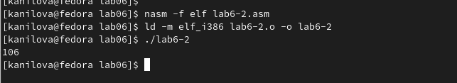{ #fig:007 width=70%, height=70% }

Когда я запустила модифицированную программу, на экране появилось число 106, 
как это показано на рисунке [-@fig:007]. В этом случае, так же как и в первом примере, 
команда add сложила ASCII-коды цифр '6' и '4' (54+52=106). Но благодаря функции iprintLF, 
на этот раз на экран вывелось именно число, а не символ, соответствующий его ASCII-коду.

Таким же образом, как и в предыдущем примере, я заменила символы на их числовые 
эквиваленты, что изображено на рисунке [-@fig:008].

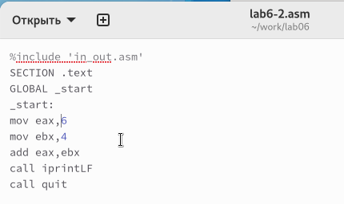{ #fig:008 width=70%, height=70% }

В этой ситуации функция iprintLF использовалась для отображения числового значения, 
так как операнды были числами, а не символьными кодами. Это привело к результату, 
который равен числу 10, как можно увидеть на рисунке [-@fig:009].

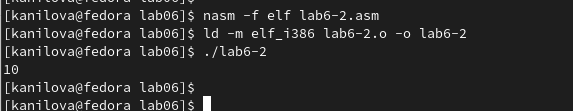{ #fig:009 width=70%, height=70% }

Затем я заменила функцию iprintLF на функцию iprint. 
После того, как я скомпилировала и запустила программу, результат изменился: 
теперь вывод не содержал переноса строки, что иллюстрируется на рисунке [-@fig:010].

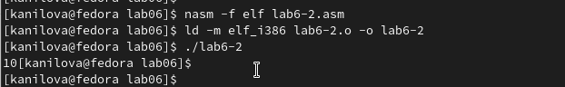{ #fig:010 width=70%, height=70% }

## Выполнение арифметических операций в NASM

Возьмем, к примеру, код, который я написала для вычисления функции 
$$f(x) = (5 * 2 + 3)/3$$. 
Вы можете посмотреть, как он работает, на иллюстрациях [-@fig:011] и [-@fig:012].

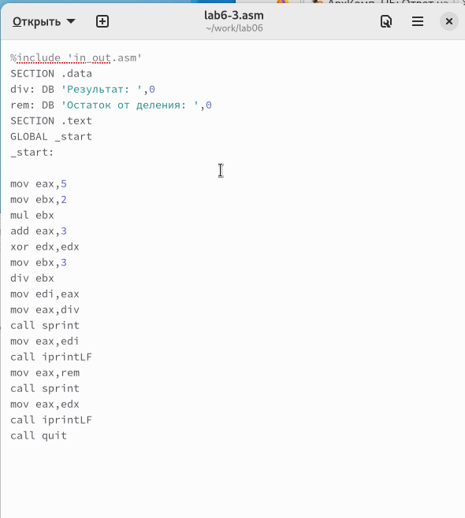{ #fig:011 width=70%, height=70% }

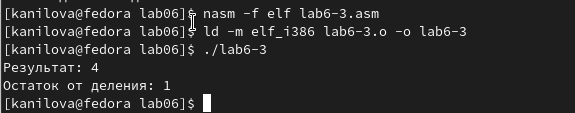{ #fig:012 width=70%, height=70% }

После этого я немного изменила исходный код, чтобы он мог рассчитать другую функцию: 
$$f(x) = (4 * 6 + 2)/5$$. 
После того как я скомпилировала измененный код и получила исполняемый файл, 
я провела его тестирование. Показано на рисунках [-@fig:013] и [-@fig:014].

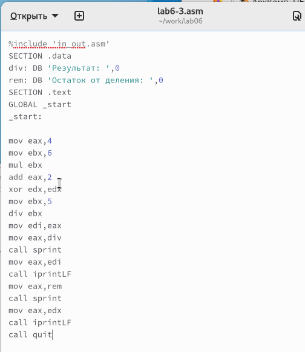{ #fig:013 width=70%, height=70% }

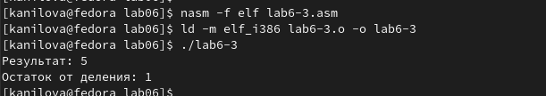{ #fig:014 width=70%, height=70% }

Давайте взглянем на программу, которая вычисляет результаты, исходя из номера 
студенческого билета. Показано на рисунках [-@fig:015] и [-@fig:016].

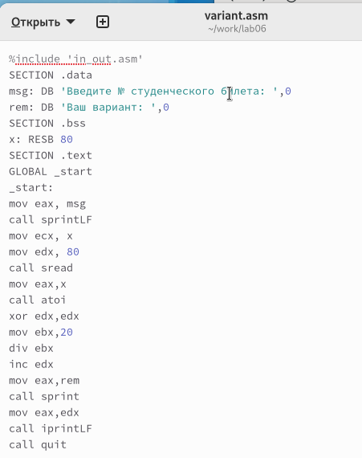{ #fig:015 width=70%, height=70% }

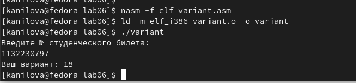{ #fig:016 width=70%, height=70% }

### Ответы на вопросы

1. Какие строки листинга отвечают за вывод на экран сообщения ‘Ваш вариант:’?

Строки кода, отвечающие за показ сообщения "Ваш вариант:", включают загрузку этого сообщения в регистр с помощью команды "mov eax, rem", а также вызов функции вывода на экран с помощью "call sprint".

2. Для чего используются следующие инструкции?

Инструкции "mov ecx, x" и "mov edx, 80" используются для передачи значения из переменной x в регистр ecx и установки числа 80 в регистр edx соответственно. Для считывания номера студенческого билета применяется команда "call sread".

3. Для чего используется инструкция "call atoi"?

Инструкция "call atoi" служит для конвертации строки символов в числовое значение.

4. Какие строки листинга отвечают за вычисления варианта?

Вычисление варианта производится с помощью обнуления регистра edx командой "xor edx, edx", загрузки числа 20 в регистр ebx с помощью "mov ebx, 20", выполнения деления на 20 через "div ebx" и увеличения результата на единицу с помощью "inc edx".

5. В какой регистр записывается остаток от деления при выполнении инструкции "div ebx"?

При выполнении операции деления "div ebx" остаток помещается в регистр edx.
 
6. Для чего используется инструкция "inc edx"?

Команда "inc edx" используется для инкрементирования содержимого регистра edx на единицу, что необходимо при вычислении варианта.

7. Какие строки листинга отвечают за вывод на экран результата вычислений?

Вывод результатов вычислений на экран осуществляется путем помещения результата в регистр eax с помощью "mov eax, edx" и последующего вызова функции "call iprintLF" для вывода на экран.

## Самостоятельное задание

Написать программу вычисления выражения y = f(x). Программа должна выводить выражение 
для вычисления, выводить запрос на ввод значения x, 
вычислять заданное выражение в зависимости от введенного x, выводить результат вычислений. 
Вид функции f(x) выбрать из таблицы 6.3 вариантов заданий в соответствии с номером 
полученным при выполнении лабораторной работы. 
Создайте исполняемый файл и проверьте его работу для значений x1 и x2 из 6.3.

Получили вариант 18 - $$3(x + 10) - 20$$  для $$x_{1}=1, x_{2}=5$$ 
(рис. [-@fig:017] и [-@fig:018])

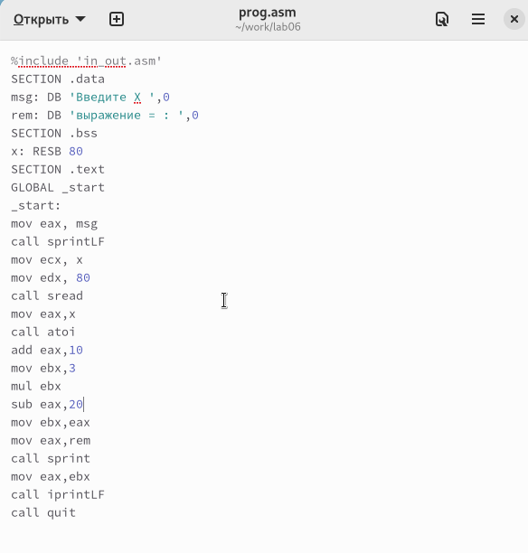{ #fig:017 width=70%, height=70% }

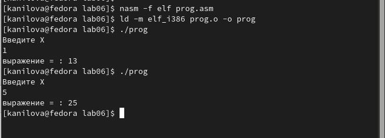{ #fig:018 width=70%, height=70% }

# Выводы

Изучили работу с арифметическими операциями.