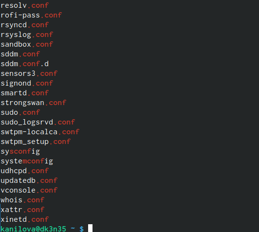

---
## Front matter
lang: ru-RU
title: Лабораторная работа №8
subtitle: "Анализ файловой системы Linux.Команды для работы с файлами и каталогами"
author:
  - Нилова Кристина 
institute:
  - Российский университет дружбы народов, Москва, Россия

## i18n babel
babel-lang: russian
babel-otherlangs: english

## Formatting pdf
toc: false
toc-title: Содержание
slide_level: 2
aspectratio: 169
section-titles: true
theme: metropolis
header-includes:
 - \metroset{progressbar=frametitle,sectionpage=progressbar,numbering=fraction}
 - '\makeatletter'
 - '\beamer@ignorenonframefalse'
 - '\makeatother'
---

# Информация

## Докладчик

:::::::::::::: {.columns align=center}
::: {.column width="70%"}

  * Нилова Кристина
  * студентка НБИбд-02-23 
  * Российский университет дружбы народов

:::
::: {.column width="30%"}

:::
::::::::::::::

# Вводная часть
 
## Вводная часть 

В данной лабораторной работе мы рассмотрим:
- Команды для работы с файлами и каталогами
- Копирование файлов и каталогов
- Перемещение и переименование файлов и каталогов
- Права доступа
- Изменение прав доступа
- Анализ файловой системы

## Объект и предмет исследования

- Команда touch - Команда fsck - Команда mkfs - Команда kill
- Команда mount - Команда cat - Команда less - Команда ls
- Команда chmod - Команда rm - Команда cp - Команда mv

# Цель работы

## Цель работы

   Целью лабораторной работы является ознакомление с файловой системой Linux, её структурой, именами и содержанием
каталогов. Приобретение практических навыков по применению команд для работы
с файлами и каталогами, по управлению процессами (и работами), по проверке исполь-
зования диска и обслуживанию файловой системы.

# Выполнение лабораторной работы

# Первый этап

## 1
  Запишим в файл file.txt названия файлов, содержащихся в каталоге /etc. Допи-
шите в этот же файл названия файлов, содержащихся в вашем домашнем каталоге

{#fig:001 width=70%}

#

# Второй этап

##  2
Выведем имена всех файлов из file.txt, имеющих расширение .conf, после чего
запиши их в новый текстовой файл conf.txt. 

{#fig:002 width=70%}

## 2

{#fig:003 width=70%}
  

# Третий этап

## 3

Оределим какие файлы в домашнем каталоге начинаются с 
символа с. 
    
{#fig:004 width=70%}

## 3.1
Выведем на экран имена файлов из каталога /etc, начинающиеся 
с символа h

{#fig:005 width=70%}

## 3.1

{#fig:006 width=70%}

## 3.2
 Запустим в фоновом режиме процесс, который будет записывать в файл ~/logfile файлы, имена который начинаются с log, удалим logfile.

{#fig:007 width=70%}
## 3.3
Запустим из консоли в фоновом редиме gedit.
 
{#fig:008 width=70%}
    
## 3.4
 -rw-rw-r-- ... feathers

[выполнение команды](image/9.png){#fig:009 width=70%}
# Четвёртый этап

## 4
4 Определим индефикатор процесса с помощью команды ps 

{#fig:010 width=70%}

## 4

Изучим команду kill и с помощью неё прекратим gedit

{#fig:011 width=70%}
## 4
{#fig:012 width=70%}
## 4

4.9. Изучим и выполним команды df и du
{#fig:013 width=70%}

## 4

{#fig:014 width=70%}

## 4

{#fig:015 width=70%}

# Пятый этап

## 5

{#fig:016 width=70%}

## 5

С помощью команды find выведем именя всех директорий 
{#fig:017 width=70%}
## 5

{#fig:018 width=70%}
## 5

# Вывод

## Выводы

Мы ознакомились с файловой системой Linux, её структурой, именами и содержанием
каталогов. Приобрели практические навыки по применению команд для работы
с файлами и каталогами, по управлению процессами (и работами), по проверке исполь-
зования диска и обслуживанию файловой системы.

